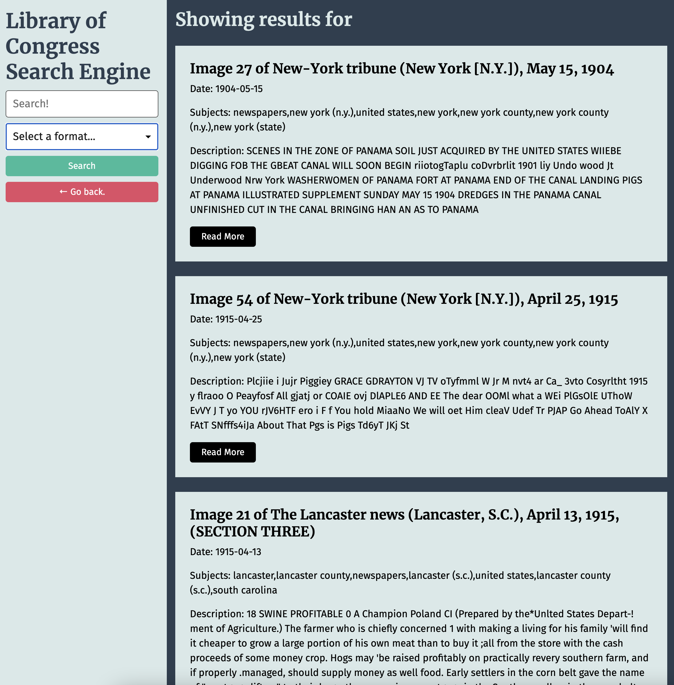

# Library of Congress Search Tool

## Search The Library of Congress with this easy to use tool! 

### Features

1. Filter searches by selecting a format.
2. See a brief description of searched information.
3. Access full article, picture etc with the Read More button.

### Pictures:
#### The home page shows a search bar with the ability to select a format from a dropdown menu.

#### The search results page displays results from a search conducted in the form on the left side of the page.

# Technologies used

1. jQuery
2. CSS
3. HTML

## Contact Info 

KarenHarley88@gmail.com
#### Links:

Github:
https://github.com/KarenHarley/Library-of-Congress-Search-Tool

Site:
https://karenharley.github.io/Library-of-Congress-Search-Tool/
